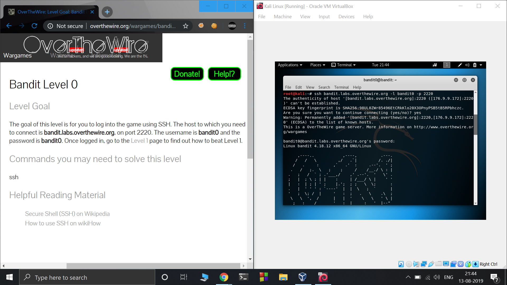
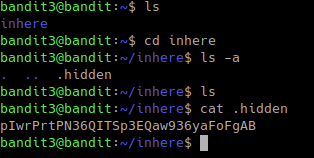

# OverTheWire CTF Solutions

## Bandit

### Level 0

### Level 0 &rarr; Level 1

 - `cat readme`

### Level 1 &rarr; Level 2

 - `cat ./-`

### Level 2 &rarr; Level 3

 - `cat "spaces in this filename"`

### Level 3 &rarr; Level 4

 - `ls -a`: a stands for all shows entries that starts with ‘.’ which are generally hidden.
 - `cat .hidden`

### Level 4 &rarr; Level 5

 - `cd inhere`
 - `ls`
 - `file ./-f*`. Note: `file *` lists the data types of all the files but since the file name starts with `-f`. `*` will give `ile00` instead of `-file00`  and so on therfore giving the wrong output. To overcome this we use `./-f*`.
 - `cat ./-file07`

### Level 5 &rarr; Level 6

Command: `find . -type f -readable ! -executable -size 1033c`

Explanation:
 - The `-readable` flag indicates file is in “human readable” form.
 - `! executable` because the file should not be executable :p
 - `-size 1033c` indicating file size specified by the problem statement.

### Level 6 &rarr; Level 7

Command: `find / -user bandit7 -group bandit6 -size 33c 2>&1 | grep -v "Permission denied" | grep -v "No such file or directory"`

Explanation:
 - `-user`, `-group`, `-size` to search for the specified user, group and file size.
 - `2>&1`: basically redirect any stdout message which is an error message of type “Permission denied” or “No such file or directory” to stderr.
 - The file containing password is the only file without the above mentioned errors.

### Level 7 &rarr; Level 8

Command: `cat data.txt | grep "millionth"`

Explanation:
 - `grep` is a command line utility to filter text with the help of regular expressions

### Level 8 &rarr; Level 9

Command: `sort data.txt | uniq -u`

Explanation:
 - `sort` command sorts all lines in the specified file
 - `uniq -u` return only the lines which are repeated only once

### Level 9 &rarr; Level 10

Command: `strings data.txt | grep "====="`

Explanation:
 - `strings` command prints only human readable characters from a file

### Level 10 &rarr; Level 11

Command: `base64 -d data.txt`

Explanation:
 - `base64 -d` decodes a base64 encoded string

### Level 11 &rarr; Level 12

Command: `cat data.txt | tr '[a-zA-Z]' '[n-za-mN-ZA-M'`

Explanation:
 - `tr` converts elements from one set to another
 - `[a-zA-Z]` makes a set of lowercase+uppercase in normal order
 - `[n-za-mN-ZA-M]` makes a set shifted by 13 digits

